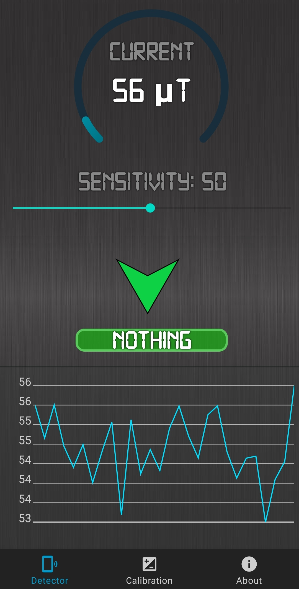
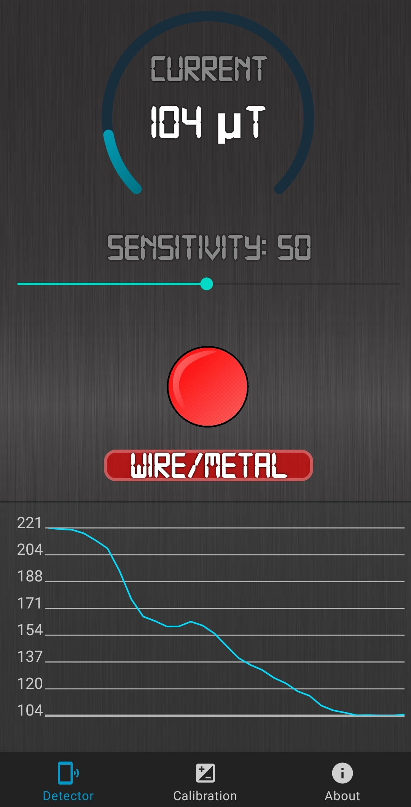
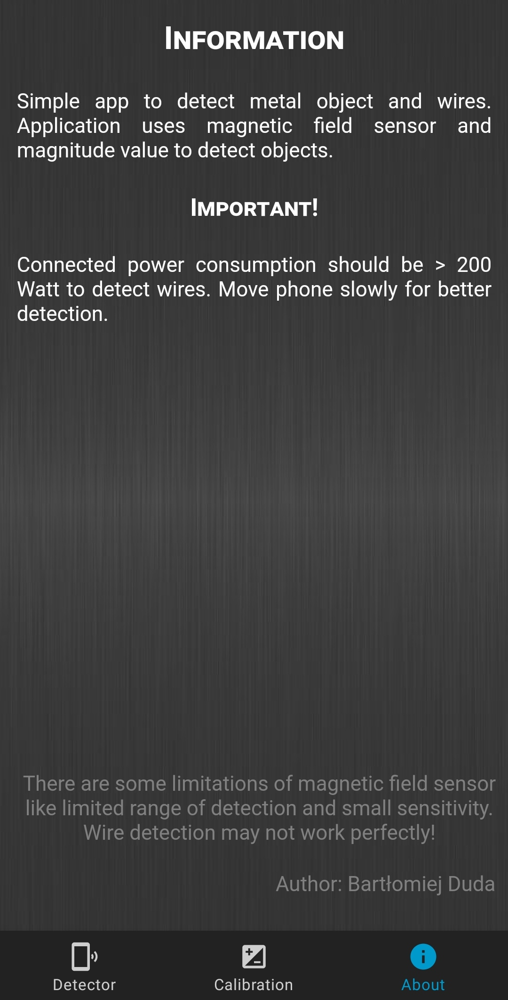
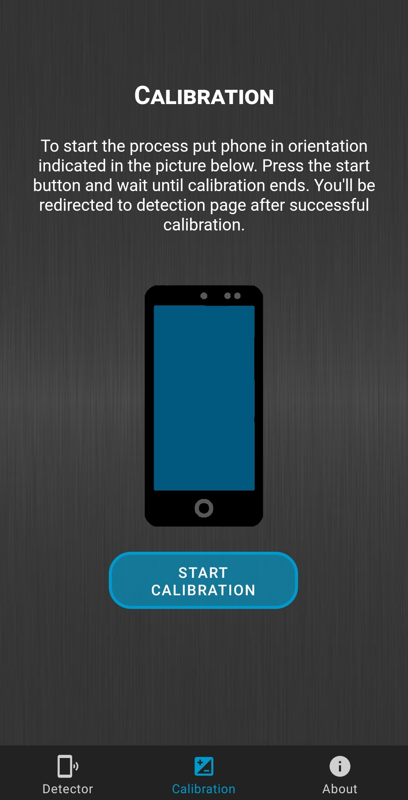

# Introduction

  

Cable Detector is a simple app to detect metal object and wires. It uses magnetic field sensor and it's magnitude value to detect object.

### Features

Application has built-in functions to calibrate sensor for better detection like sensitivity and reading enviroment base magnitude field value as a base value. 
Application also indicates to the user where possible wire can be.

  

  

  

  

For more details see [GitHub Flavored Markdown](https://guides.github.com/features/mastering-markdown/).

### Jekyll Themes

Your Pages site will use the layout and styles from the Jekyll theme you have selected in your [repository settings](https://github.com/Volseth/CableDetector/settings). The name of this theme is saved in the Jekyll `_config.yml` configuration file.

### Support or Contact

Having trouble with Pages? Check out our [documentation](https://docs.github.com/categories/github-pages-basics/) or [contact support](https://github.com/contact) and we’ll help you sort it out.
